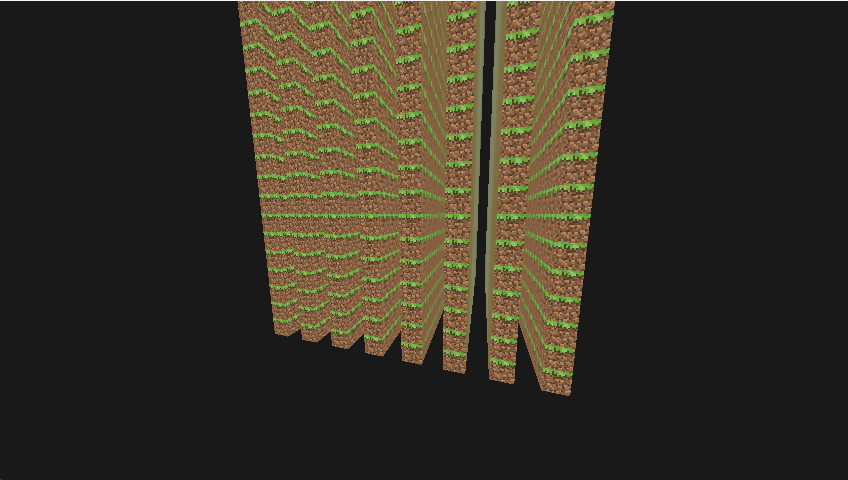

# Call of a Hero

[→ YouTube Channel — All Demos](https://www.youtube.com/@andrewson5330)

> **⚠️ This is an architectural rewrite in early development. For the full project and its code — multithreading, mob AI, 300 FPS, 14,000+ lines — see the original:**
> ### [→ cpp-zero-to-hero (THE MAIN PROJECT)](https://github.com/Okaimono/cpp-zero-to-hero)

A voxel game engine rebuilt from scratch in C++ and OpenGL — clean architectural rewrite of **[cpp-zero-to-hero](https://github.com/Okaimono/cpp-zero-to-hero)**.

---

## What This Is

After building a 14,000+ line voxel engine from scratch with no prior C++ experience, I started over — same ambition, better architecture. The original runs at 300 FPS with 45-chunk render distance, multithreaded chunk streaming, mob AI, and a full GUI system. This rewrite enforces the structural discipline the first pass didn't have.

**Current State:** Basic chunk system rendering a grass chunk in an empty void. Foundation is solid, features come next.

**Started:** February 2026

## What The Original Built

The original engine this rewrites — [cpp-zero-to-hero](https://github.com/Okaimono/cpp-zero-to-hero) — includes:

- Multithreaded chunk streaming with async two-phase job queue
- 4GB GPU memory pool with slot-based chunk management
- A* pathfinding with custom node pool and zero heap allocations during search
- Hand-rolled inverse kinematics for first-person arm rendering
- Layered noise terrain generation with biome interpolation
- Full inventory, crafting, furnace, and chest GUI systems
- Fixed-timestep physics with AABB collision
- 45 chunk render distance at 300 FPS
- Real-time 3D math — linear algebra, orthonormal basis construction, quaternion-based smoothing

---

## Demo

*Clean engine rewrite — single chunk demo*

---

## Architecture

The rewrite enforces strict boundaries the original didn't have:

- **Engine/game separation** — the engine layer has zero knowledge of game logic
- **Dependency injection over singletons** — systems receive dependencies through constructors, not global state
- **Typed mesh handles** — GPU resources managed through typed handles, not raw OpenGL IDs
- **Command queue render batching** — draw calls queued and submitted in batches
- **Clean data flow** — `Game → RenderPipeline → Renderer → OpenGL`

---

## Gallery

  
  

---

## Tech

C++17, OpenGL 3.3, GLFW, GLAD, GLM, stb_image

## Note

External dependencies and Mojang textures are not included in either repository. GLAD is bundled in `src/` for simplicity.

C++17, OpenGL 3.3, GLFW, GLAD, GLM, stb_image

## Note

External dependencies and Mojang textures are not included in either repository. GLAD is bundled in `src/` for simplicity.
